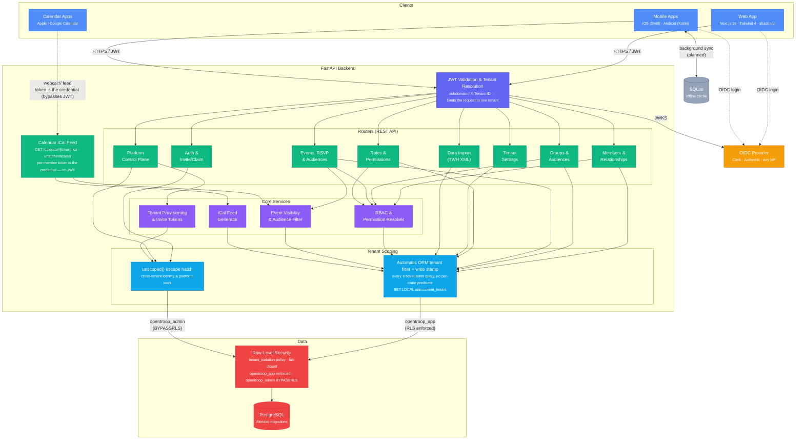

# OpenTroop

A modern, mobile-first, open-source troop management platform.

OpenTroop is designed to support the complex operational needs of scouting units. Our early focus is providing robust **Event Management** and **Communication** tools, with Advancement and Reporting planned for future phases. Built **offline-first**, it ensures that leaders can continue working seamlessly at camps or in the wilderness without cellular service. Every data record is designed for background synchronization (using client-generatable UUIDv7 keys, per-row timestamps, and soft-delete tombstones) and is securely partitioned by `tenant_id` to support robust multi-tenant SaaS deployments.

**Phase 1 scope:** Membership / Contact Management and Event Management.

## Architecture



**Tenant isolation is defense-in-depth.** Tenant resolution binds each request to a single tenant; the app layer then auto-scopes every `TrackedBase` query (read filter + write stamp) so no route hand-carries a `tenant_id` predicate, and Postgres Row-Level Security re-enforces the same boundary at the database — fail-closed, so a request that forgets to set the tenant sees zero rows rather than all of them. Cross-tenant identity and platform work opts out explicitly through the greppable `unscoped()` escape hatch, paired with the `BYPASSRLS` `opentroop_admin` role.

```
apps/web/      Next.js 16 · Tailwind 4 · shadcn/ui · Clerk auth. Uses middleware for logical domain routing (landing vs admin vs tenant)
apps/mobile/   Expo (React Native) — stub, to be scaffolded
backend/       FastAPI app, ORM models, Pydantic schemas, Alembic, tests
packages/      Shared TypeScript packages (api-client)
```

## Quick start

```bash
./start.sh
```

Validates that your Clerk configuration is consistent between frontend and backend, starts Postgres via Docker, runs the backend with uvicorn, and launches the Next.js dev server. See [docs/local-setup.md](docs/local-setup.md) for the full first-time setup walkthrough.

## Local development

**Frontend** — requires [pnpm](https://pnpm.io) and Node 22.13+ (pnpm 11 needs it):

```bash
npm install -g pnpm
pnpm install                                         # install all workspace deps
cp apps/web/.env.local.example apps/web/.env.local   # add Clerk keys
pnpm dev                                             # start web app on :3000
```

**Backend** — requires [uv](https://docs.astral.sh/uv/) and Python 3.12:

```bash
curl -LsSf https://astral.sh/uv/install.sh | sh      # install uv once
```

Then from `backend/`:

```bash
uv sync                                              # create .venv/ and install all deps
uv run pytest                                        # run the test suite (no database needed)
uv run uvicorn app.main:app --reload                 # start the API on :8000
```

### Pre-commit hooks

```bash
# Install pre-commit once (uses uv's global tool layer)
uv tool install pre-commit --with pre-commit-uv

# Wire hooks into git (once per clone)
pre-commit install

# Or run manually
pre-commit run --all-files
```

Hooks cover trailing whitespace, YAML/TOML/JSON validation, secret scanning (gitleaks), Python linting/formatting + types (ruff, mypy — pinned via `uv.lock`), and frontend type-checking + linting (`tsc`, `eslint` — pinned via `pnpm-lock.yaml`).

## Data model (Phase 1)

**Platform-level (global, no tenant scope):**
- **Tenant** — one row per troop; its `id` is the `tenant_id` on every other table.
- **User** — a platform login identity (spans tenants; one person can be a member in multiple troops).
- **Identity** — one OIDC provider credential per User (Google, Apple, passkeys, etc.).

**Tenant-scoped (every row carries `tenant_id`):**
- **Group** — a resolvable set of members (manual and/or dynamic role-based); patrols are groups too. Drives event visibility and messaging.
- **Member** — scouts and adults, with BSA `swim_classification`, group memberships, OA fields, and a nullable link to a `User` login account.
- **MemberRelationship** — guardian/parent/sibling graph linking members.
- **RBAC (two levels)** — `member → Position(s) → FunctionalRole(s) → Permission(s)`.
  A **Position** is what a member *is* (the sole assignable unit); a **FunctionalRole**
  is a named permission bundle; **PositionFunctionalRole** maps positions into roles and
  **FunctionalRolePermission** grants permissions to roles.
- **MemberPositionAssignment** — a member's dated *term* holding a position (the routine write), with a soft-delete audit trail.
- **Location** — reusable named locations (address, phone, directions) referenced by events.
- **EventType** — tenant-customizable event categories with capability flags (`tracks_camping_nights`, `allow_signups`, etc.); six defaults seeded on provisioning.
- **Event** — core event record with dates, location, costs, activity metrics, signup window, and capacity limits.
- **EventOrganizer** — which members are running a given event.
- **EventParticipant** — per-member RSVP, attendance, activity overrides, and permission slip tracking.

All tables inherit `id` (UUIDv7), `created_at`, `updated_at`, and `is_deleted` from a shared base. Tenant-scoped tables additionally carry `tenant_id`.

## Authentication

OpenTroop validates standard OIDC JWTs — any compliant provider works.
See **[docs/auth-provider-setup.md](docs/auth-provider-setup.md)** for step-by-step Clerk (SaaS) and Authentik (self-hosted) setup.

## Deployment

See **[docs/deployment.md](docs/deployment.md)** for a full guide.
The recommended production setup is **Google Cloud Run + Cloud SQL**, which starts at ~$10–15/month and scales to hundreds of troops without rearchitecting.

## Contributing

OpenTroop is developed in the open (AGPLv3) and welcomes contributors.

- **[ROADMAP.md](ROADMAP.md)** — the strategic map: six capability pillars and their order.
- **[GitHub Issues](../../issues)** — the actionable backlog, grouped by [Milestone](../../milestones) (one per pillar). Good starting points are the [`good first issue`](../../issues?q=is%3Aissue+is%3Aopen+label%3A%22good+first+issue%22) and [`help wanted`](../../issues?q=is%3Aissue+is%3Aopen+label%3A%22help+wanted%22) labels.
- **[CONTRIBUTING.md](CONTRIBUTING.md)** — dev setup, branch/PR conventions, and the non-negotiable schema rules for the offline-sync contract.

For significant changes (new models, new API surfaces, architectural decisions), open an issue to discuss the approach first; non-trivial features get a spec in `docs/spec/`.
