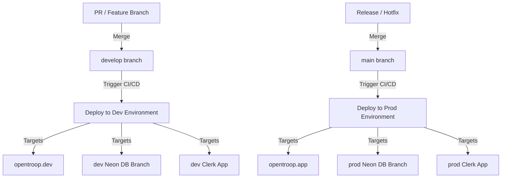

# DevOps & GitOps Restructuring Specification

**Status:** Proposed
**Scope:** Infrastructure, CI/CD, GitOps, Domain Isolation, Image Publishing

---

## Overview

As OpenTroop moves closer to a production-ready SaaS product, the devops setup needs to evolve to support multiple isolated tiers:
1. **Production:** Main platform serving real tenant traffic.
2. **Staging / Development:** Automated integration testing and feature verification.

This specification outlines the transition from a shared domain/auth setup to fully isolated environments, automated branch-based GitOps deployments, and public Docker image publishing for self-hosters.

---

## 1. Domain & Network Isolation

To prevent cookies bleeding (session pollution) and avoid overlapping Cloudflare Worker routes, the environments must reside on completely separate domain apexes.

### Architecture

| Environment | Domain Apex | Wildcard Routing | API Domain |
|---|---|---|---|
| **Production** | `opentroop.app` | `*.opentroop.app` | `api.opentroop.app` |
| **Development** | `opentroop.dev` | `*.opentroop.dev` | `api.opentroop.dev` |

### Cloudflare Worker Configuration
* **Production Worker (`opentroop-proxy`):**
  * Route Patterns: `opentroop.app/*`, `*.opentroop.app/*`
* **Development Worker (`opentroop-dev-proxy`):**
  * Route Patterns: `opentroop.dev/*`, `*.opentroop.dev/*`

---

## 2. Authentication Isolation (Clerk)

To prevent cross-environment sign-in contamination and redirection confusion, distinct Clerk applications must be provisioned.

### Setup
* **Development Clerk Application:**
  * Hostname: Managed dynamically (e.g. `merry-arachnid-21.accounts.dev` or a custom sub-domain of `opentroop.dev`)
  * Allowed Redirect Origins: `localhost:3000`, `*.opentroop.dev`
  * database: Connected to the `dev` Neon database instance/branch.
* **Production Clerk Application:**
  * Hostname: Custom sub-domain (e.g., `auth.opentroop.app`)
  * Allowed Redirect Origins: `*.opentroop.app`
  * database: Connected to the `prod` Neon database instance.

---

## 3. GitOps Branching & Environment Strategy

Deployments will be driven automatically by pushes to environment branches:

### GitHub Environments Scoping

Secret and variable namespaces will be isolated using GitHub Environments:

* **Environment: `development`** (linked to branch `develop`)
  * Secrets: `DATABASE_URL_MIGRATE` (dev), `CLERK_SECRET_KEY` (dev)
  * Variables: `GCP_PROJECT_ID` (dev), `APP_DOMAIN` (`opentroop.dev`)
* **Environment: `production`** (linked to branch `main`)
  * Secrets: `DATABASE_URL_MIGRATE` (prod), `CLERK_SECRET_KEY` (prod)
  * Variables: `GCP_PROJECT_ID` (prod), `APP_DOMAIN` (`opentroop.app`)

---

## 4. Open-Source Image Publishing

To support the self-hosted mode without exposing private GCP Artifact Registry credentials, OpenTroop will publish built containers to the public **GitHub Container Registry (GHCR)**.

### Release Registry Flow
1. **GitHub Actions Build Step:**
   * Build backend and frontend images.
   * Log in to `ghcr.io` using the `GITHUB_TOKEN` provided by the workflow runtime.
   * Push images to:
     * `ghcr.io/nonprodhuman/opentroop-api`
     * `ghcr.io/nonprodhuman/opentroop-web`
2. **Cloud Run Pull:**
   * Terraform/GCP services pull from the public `ghcr.io` image targets.
3. **Self-Hosted Access:**
   * Anyone can pull the official images using a standard Docker compose setup.

---

## 5. Versioning Strategy

Deployments to development and production will follow a structured tagging strategy:

* **Pushes to `develop`:** Tag images as `:dev` and `:latest-dev`.
* **Pushes/Merges to `main`:** Tag images as `:latest`, and run an automated action (e.g. `semantic-release` or custom script) to:
  * Compute next SemVer tag (e.g. `v1.0.0`) based on commit convention.
  * Generate a GitHub Release.
  * Tag images with major/minor/patch versions (e.g. `:v1.0.0`, `:v1.0`, `:v1`).
